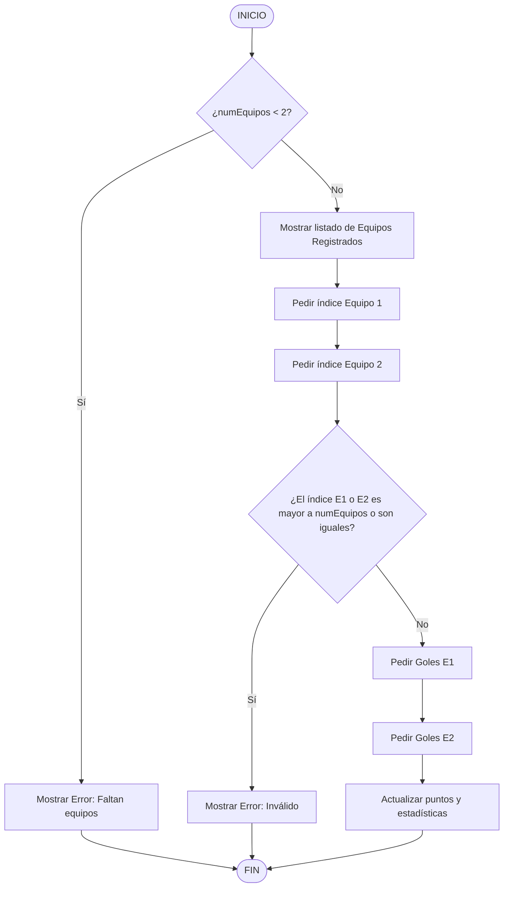
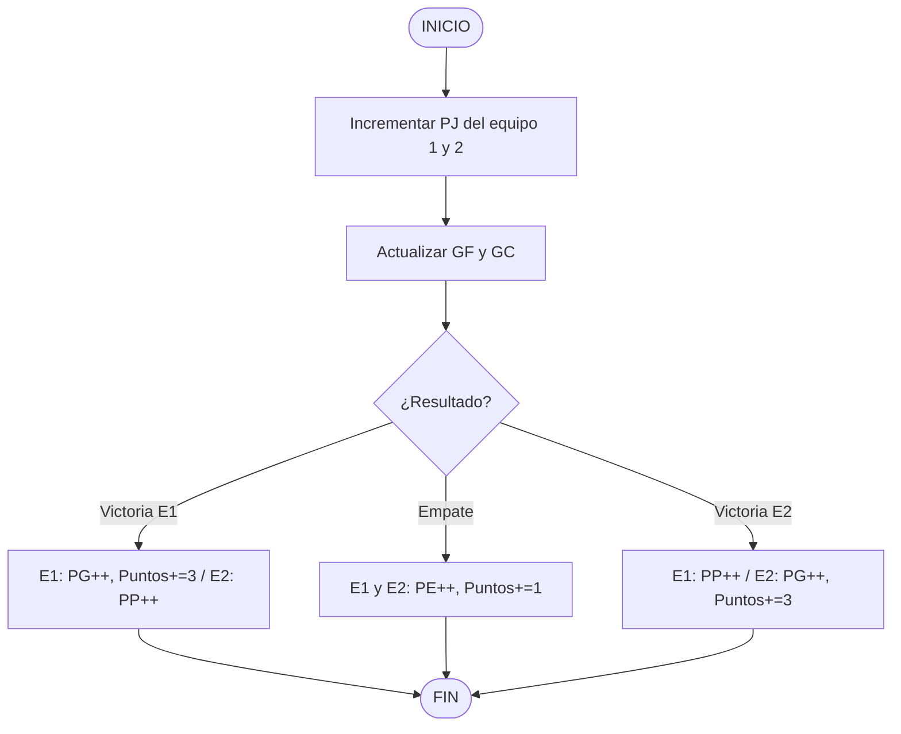

# 🏆 Guía del Proyecto 4: Simulador de Torneo de Fútbol

> Esta guía te llevará paso a paso aplicando metodología **Scrum** para organizar el trabajo y **Git** para versionar el código. Tú escribirás todo el código C++; yo te proporciono los diagramas y el pseudocódigo como planos.

---

## FASE 0: Organización con Scrum y Git

### El Equipo: 3 Integrantes, 3 Roles Scrum
| Rol | Responsabilidad |
|-----|-----------------|
| **Product Owner** | Define qué se construye y en qué orden. Prioriza el backlog. |
| **Scrum Master** | Facilita las reuniones, elimina bloqueos, protege al equipo. |
| **Developer** | Escribe el código. En un equipo pequeño, todos programan. |

> 💡 En equipos pequeños los 3 roles pueden repartirse así: 1 persona como Product Owner + Developer, 1 como Scrum Master + Developer, 1 como Developer puro.

---

#### 🎯 Product Backlog con asignación de integrante
| ID | Historia de Usuario | Prioridad | Responsable |
|----|---------------------|-----------|-------------|
| HU-01 | Como usuario, quiero registrar equipos para el torneo | Alta | Wilmer Gulcochía |
| HU-02 | Como usuario, quiero registrar el resultado de un partido | Alta | Marco Chile |
| HU-03 | Como usuario, quiero ver la tabla de posiciones ordenada | Alta | Miriam Huamán |
| HU-04 | Como usuario, quiero buscar un equipo por nombre | Media | Wilmer Gulcochía |
| HU-05 | Como usuario, quiero ver el equipo campeón | Alta | Marco Chile |

#### 🗓️ Sprint Planning: Dividimos en 2 Sprints
**Sprint 1:** HU-01 (Wilmer), HU-02 (Marco) — trabajan en paralelo
**Sprint 2:** HU-03 (Miriam), HU-04 (Wilmer), HU-05 (Marco) — trabajan en paralelo

---

#### 🌿 Estrategia de Ramas Git para 3 personas

Cada integrante trabaja en su propia rama y luego hace un **Pull Request** para que el equipo revise antes de fusionar.

```bash
# Wilmer (Product Owner) sube la estructura base a GitHub
git add proyecto4.cpp
git commit -m "feat: scaffold base del proyecto - stubs listos para el equipo"
git push

# Cada integrante clona y crea su propia rama desde main
# Wilmer Gulcochía:
git checkout -b feature/HU-01-registro-equipos

# Marco Chile:
git checkout -b feature/HU-02-registro-partidos

# Miriam Huamán:
git checkout -b feature/HU-03-tabla-posiciones
```

**Flujo de Pull Request (como en GitHub):**
1. Cada uno termina su función y hace commit en su rama.
2. Sube su rama: `git push origin feature/HU-01-registro-equipos`
3. Abre un **Pull Request** en GitHub.
4. Otro integrante revisa el código y aprueba.
5. Se fusiona a `main`.

---

## FASE 1: Estructura de Datos

### Variables Globales (Sin usar ARREGLOS)
```text
CONSTANTE MAX_EQUIPOS = 4
VARIABLE GLOBAL numEquipos = 0

// Variables Equipo 1
string e1_nombre;
int e1_pj, e1_pg, e1_pe, e1_pp, e1_gf, e1_gc, e1_puntos;

// Variables Equipo 2
string e2_nombre;
int e2_pj, e2_pg, e2_pe, e2_pp, e2_gf, e2_gc, e2_puntos;

// Variables Equipo 3
string e3_nombre;
int e3_pj, e3_pg, e3_pe, e3_pp, e3_gf, e3_gc, e3_puntos;

// Variables Equipo 4
string e4_nombre;
int e4_pj, e4_pg, e4_pe, e4_pp, e4_gf, e4_gc, e4_puntos;
```

---

## FASE 2: Diagrama de Flujo — Menú Principal


---

## FASE 3: Diagrama de Flujo — Registrar Partido

> **Entregable 1 del proyecto**



---

## FASE 4: Diagrama de Flujo — Actualización de Puntos

> **Entregable 2 del proyecto**



---

## FASE 5: Pseudocódigo del Sistema Completo

> **Entregable 3 del proyecto**

### 5.1 — Lógica del CASO 1: Registrar Equipo
```text
CASO 1:
    SI numEquipos >= MAX_EQUIPOS ENTONCES
        MOSTRAR "Límite de equipos alcanzado"
        ROMPER (break)
    
    LEER nombre del nuevo equipo
    
    // Validación de nombres (en vez de arreglo, se usan IFs)
    yaExiste = FALSO
    SI numEquipos >= 1 Y nombre == e1_nombre ENTONCES yaExiste = VERDADERO
    SI numEquipos >= 2 Y nombre == e2_nombre ENTONCES yaExiste = VERDADERO
    SI numEquipos >= 3 Y nombre == e3_nombre ENTONCES yaExiste = VERDADERO
    SI numEquipos >= 4 Y nombre == e4_nombre ENTONCES yaExiste = VERDADERO

    SI yaExiste ENTONCES
        MOSTRAR "Equipo ya registrado"
    SINO
        SI numEquipos == 0 ENTONCES
            e1_nombre = nombre
        SINO SI numEquipos == 1 ENTONCES
            e2_nombre = nombre
        SINO SI numEquipos == 2 ENTONCES
            e3_nombre = nombre
        SINO SI numEquipos == 3 ENTONCES
            e4_nombre = nombre
        
        numEquipos++
        MOSTRAR "Equipo registrado correctamente"
        
    ROMPER (break)
```

### 5.2 — Lógica del CASO 2: Registrar Partido
```text
CASO 2:
    SI numEquipos < 2 ENTONCES
        MOSTRAR "Se necesitan al menos 2 equipos"
        ROMPER (break)

    MOSTRAR lista de equipos mediante (SI numEquipos >= X)

    LEER indiceE1
    LEER indiceE2

    SI indiceE1 coincide con rango Y indiceE2 coincide con rango Y indice1 != indice2 ENTONCES
        LEER golesE1
        LEER golesE2

        // Ejemplo: Si indiceE1 == 1, actualizar e1_pj, e1_gf, etc.
        SI indiceE1 == 1 ENTONCES
            e1_pj++ 
            e1_gf += golesE1
            e1_gc += golesE2
            SI golesE1 > golesE2 ENTONCES e1_pg++; e1_puntos += 3
            SINO SI golesE1 == golesE2 ENTONCES e1_pe++; e1_puntos += 1
            SINO e1_pp++
        SINO SI indiceE1 == 2 ENTONCES ... 

        // Repetir exactamente la misma lógica cruzada para indiceE2
    SINO
        MOSTRAR "Equipo no encontrado o son el mismo"
    ROMPER (break)
```

### 5.3 — Lógica del CASO 3: Mostrar Tabla
```text
CASO 3:
    MOSTRAR cabecera: "Equipo | PJ | PG | PE | PP | GF | GC | Puntos"
    
    SI numEquipos >= 1 ENTONCES 
        MOSTRAR e1_nombre, e1_pj, e1_pg, e1_pe, e1_pp, e1_gf, e1_gc, e1_puntos
    SI numEquipos >= 2 ENTONCES
        MOSTRAR e2_nombre, e2_pj, e2_pg, e2_pe, e2_pp, e2_gf, e2_gc, e2_puntos
    SI numEquipos >= 3 ENTONCES
        MOSTRAR e3_nombre ...
    SI numEquipos >= 4 ENTONCES
        MOSTRAR e4_nombre ...
    ROMPER (break)
```

### 5.4 — Lógica del CASO 4: Buscar Equipo
```text
CASO 4:
    LEER nombreBuscado
    encontrado = FALSO
    
    SI numEquipos >= 1 Y nombreBuscado == e1_nombre ENTONCES
        MOSTRAR datos e1_nombre
        encontrado = VERDADERO
    SINO SI numEquipos >= 2 Y nombreBuscado == e2_nombre ENTONCES
        MOSTRAR datos e2_nombre
        encontrado = VERDADERO
    ... (hasta 4)
    
    SI NO encontrado ENTONCES
        MOSTRAR "Equipo no encontrado"
    ROMPER (break)
```

### 5.5 — Lógica del CASO 5: Mostrar Campeón
```text
CASO 5:
    SI numEquipos == 0 ENTONCES
        MOSTRAR "No hay equipos registrados"
        ROMPER (break)
    
    campeon_nombre = e1_nombre; max_puntos = e1_puntos
    
    SI numEquipos >= 2 Y e2_puntos > max_puntos ENTONCES campeon_nombre = e2_nombre; max_puntos = e2_puntos
    SI numEquipos >= 3 Y e3_puntos > max_puntos ENTONCES campeon_nombre = e3_nombre; max_puntos = e3_puntos
    SI numEquipos >= 4 Y e4_puntos > max_puntos ENTONCES campeon_nombre = e4_nombre; max_puntos = e4_puntos
    
    MOSTRAR "🏆 Campeón: " + campeon_nombre
    MOSTRAR "Puntos: " + max_puntos
    ROMPER (break)
```

### 5.6 — Estructura Principal: do-while y switch
```text
PROGRAMA PRINCIPAL:
    opcion = -1
    
    HACER:
        MOSTRAR menú de opciones (1-5, 0 para salir)
        LEER opcion
        
        SEGÚN opcion:
            CASO 1: (Lógica explícita en el sub-apartado 5.1)
            CASO 2: (Lógica explícita en el sub-apartado 5.2)
            CASO 3: (Lógica explícita en el sub-apartado 5.3)
            CASO 4: (Lógica explícita en el sub-apartado 5.4)
            CASO 5: (Lógica explícita en el sub-apartado 5.5)
            CASO 0: MOSTRAR "¡Hasta luego!"; ROMPER (break)
            POR DEFECTO: MOSTRAR "Opción inválida"; ROMPER (break)
    
    MIENTRAS opcion != 0
```

---

## FASE 6: Checklist de Desarrollo (Tu guía al codificar)

Marca cada ítem cuando lo implementes en tu código C++:

- [x] Declarar la constante `MAX_EQUIPOS = 4` junto con su validación limitante
- [x] Declarar `numEquipos` y el bloque rígido de 32 variables independientes (`e1_nombre... e4_puntos`)
- [x] Implementar Lógica Caso 1 (Registrar) → Crear condiciones `if-else` en cascada en lugar de `for` (máx 4 equipos)
- [x] Implementar Lógica Caso 2 (Partidos) → Ruteo masivo condicional para actualizar las variables atómicas indicadas
- [x] Implementar Lógica Caso 3 (Mostrar Tabla) → Imprimir y concatenar variables de cada uno de los 4 turnos fijos
- [x] Implementar Lógica Caso 4 (Buscar Equipo) → Evaluar comparación de Strings de manera independiente y correlativa
- [x] Implementar Lógica Caso 5 (Campeón) → Evaluar cuál de las cuatro variables aisladas de puntos es la mayor
- [x] Envolver toda la funcionalidad monolítica dentro del `do-while` y las sentencias directas del `switch` en el `main()`

---

## FASE 7: Commits Sugeridos (Git)

Al terminar cada caso de uso, haz un commit detallando tu bloque de avance:

```bash
git add proyecto4.cpp
git commit -m "HU-01: Lógica del Caso 1 (Registro) implementada con condicionales puros"

git commit -m "HU-02: Lógica del Caso 2 (Partidos) completada mapeando variables independientes"

git commit -m "HU-03: Tabla de posiciones maquetada manualmente desde variables atómicas"

git commit -m "HU-04: Motor de búsqueda lineal individual escrito"

git commit -m "HU-05: Lógica del Caso 5 para determinar el campeón terminada"

# Sprint Review: Mapeo y cierre visual colaborativo
git checkout main
git merge feature/HU-01-registro-equipos
git commit -m "Sprint cerrado: Sistema de torneo monolítico estable sin arreglos ✅"
```

---

## ¿Por dónde empezar?

**Wilmer (Product Owner):**
1. Sube `proyecto4.cpp` (ya tiene el scaffold completo) al repositorio.
2. Crea las ramas de cada integrante: `feature/HU-01`, `feature/HU-02`, `feature/HU-03`.
3. Comparte el repositorio con Marco y Miriam.

**Luego cada integrante:**
1. Clona el repositorio y cambia a su rama asignada trabajando individualmente.
2. Lee la Estructura de Datos (Fase 1) para comprender por qué se declaran tantas variables y cómo se mapea la información.
3. Abre el archivo `proyecto4.cpp`, busca el bloque del `CASO` del menú que te fue asignado e implementa las cascadas manuales.
4. Recuerda que no puedes declarar arrays ni for-loops; todo se resuelve lógicamente. Haz commits seguidos de tus avances.
5. Crea el respectivo Pull Request para que tus otros dos compañeros verifiquen que la lógica estricta no se interrumpió y procedan con su validación en Local (merge).

¡Mucho éxito al equipo enfrentando este interesante reto algorítmico! 🚀
