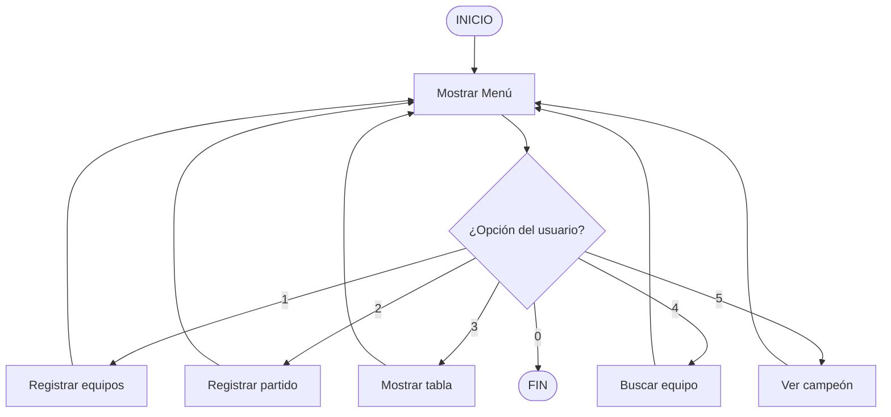
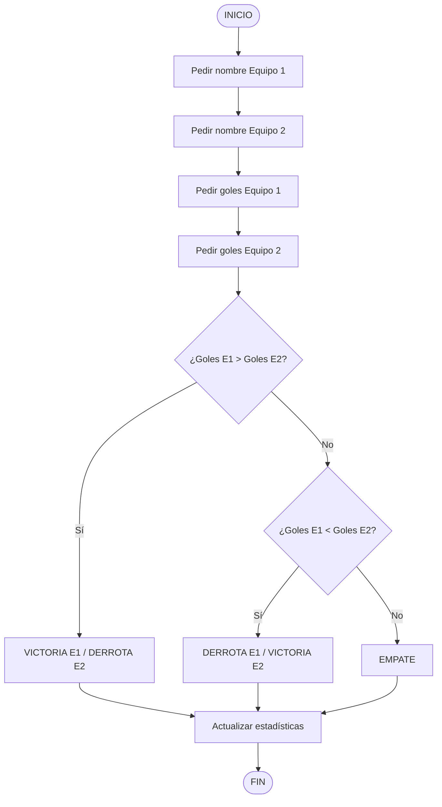
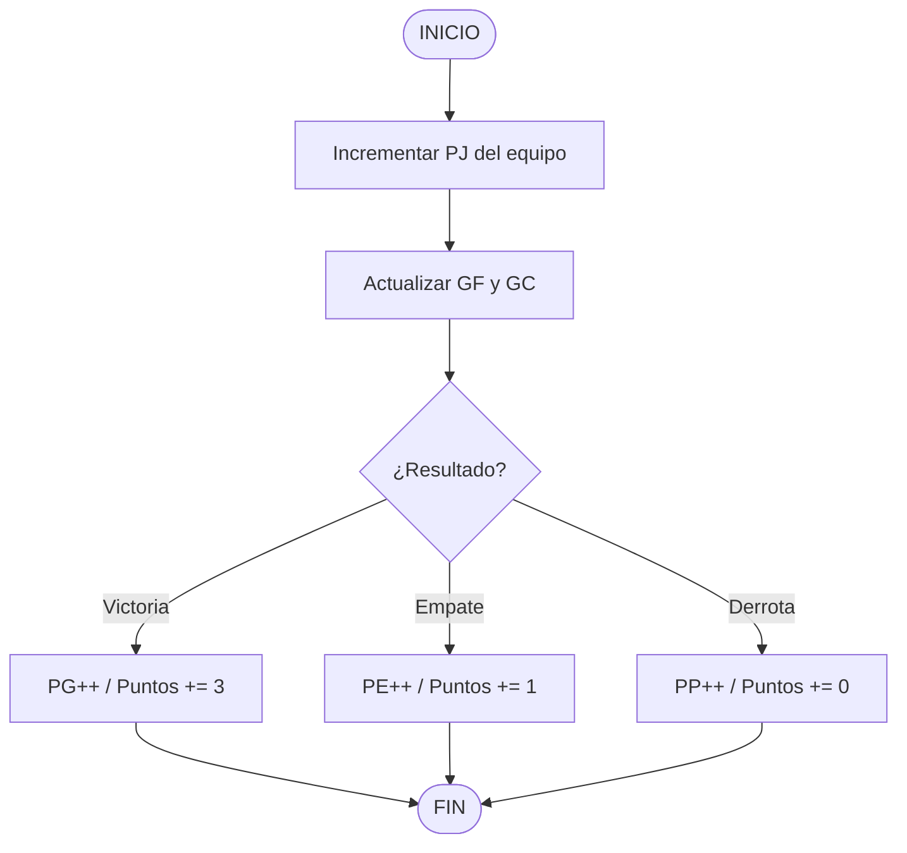

# 🏆 Guía del Proyecto 4: Simulador de Torneo de Fútbol

> Esta guía te llevará paso a paso aplicando metodología **Scrum** para organizar el trabajo y **Git** para versionar el código. Tú escribirás todo el código C++; yo te proporciono los diagramas y el pseudocódigo como planos.

---

## FASE 0: Organización con Scrum y Git

### El Equipo: 3 Integrantes, 3 Roles Scrum
| Rol | Responsabilidad |
|-----|-----------------|
| **Product Owner** | Define qué se construye y en qué orden. Prioriza el backlog. |
| **Scrum Master** | Facilita las reuniones, elimina bloqueos, protege al equipo. |
| **Developer** | Escribe el código. En un equipo pequeño, todos programan. |

> 💡 En equipos pequeños los 3 roles pueden repartirse así: 1 persona como Product Owner + Developer, 1 como Scrum Master + Developer, 1 como Developer puro.

---

#### 🎯 Product Backlog con asignación de integrante
| ID | Historia de Usuario | Prioridad | Responsable |
|----|---------------------|-----------|-------------|
| HU-01 | Como usuario, quiero registrar equipos para el torneo | Alta | Wilmer Gulcochía |
| HU-02 | Como usuario, quiero registrar el resultado de un partido | Alta | Marco Chile |
| HU-03 | Como usuario, quiero ver la tabla de posiciones ordenada | Alta | Miriam Huamán |
| HU-04 | Como usuario, quiero buscar un equipo por nombre | Media | Wilmer Gulcochía |
| HU-05 | Como usuario, quiero ver el equipo campeón | Alta | Marco Chile |

#### 🗓️ Sprint Planning: Dividimos en 2 Sprints
**Sprint 1:** HU-01 (Wilmer), HU-02 (Marco) — trabajan en paralelo
**Sprint 2:** HU-03 (Miriam), HU-04 (Wilmer), HU-05 (Marco) — trabajan en paralelo

---

#### 🌿 Estrategia de Ramas Git para 3 personas

Cada integrante trabaja en su propia rama y luego hace un **Pull Request** para que el equipo revise antes de fusionar.

```bash
# Wilmer (Product Owner) sube la estructura base a GitHub
git add proyecto4.cpp
git commit -m "feat: scaffold base del proyecto - stubs listos para el equipo"
git push

# Cada integrante clona y crea su propia rama desde main
# Wilmer Gulcochía:
git checkout -b feature/HU-01-registro-equipos

# Marco Chile:
git checkout -b feature/HU-02-registro-partidos

# Miriam Huamán:
git checkout -b feature/HU-03-tabla-posiciones
```

**Flujo de Pull Request (como en GitHub):**
1. Cada uno termina su función y hace commit en su rama.
2. Sube su rama: `git push origin feature/HU-01-registro-equipos`
3. Abre un **Pull Request** en GitHub.
4. Otro integrante revisa el código y aprueba.
5. Se fusiona a `main`.

---

## FASE 1: Estructura de Datos

### Variables Globales y Constantes
```
CONSTANTE MAX_EQUIPOS = 10

ESTRUCTURA Equipo:
    nombre        (texto)
    pj            (entero - partidos jugados)
    pg            (entero - partidos ganados)
    pe            (entero - partidos empatados)
    pp            (entero - partidos perdidos)
    gf            (entero - goles a favor)
    gc            (entero - goles en contra)
    puntos        (entero)

VARIABLE GLOBAL equipos[MAX_EQUIPOS]   ← arreglo de equipos
VARIABLE GLOBAL numEquipos = 0         ← contador de equipos registrados
```

---

## FASE 2: Diagrama de Flujo — Menú Principal



---

## FASE 3: Diagrama de Flujo — Registrar Partido

> **Entregable 1 del proyecto**



---

## FASE 4: Diagrama de Flujo — Actualización de Puntos

> **Entregable 2 del proyecto**



---

## FASE 5: Pseudocódigo del Sistema Completo

> **Entregable 3 del proyecto**

### 5.1 — Función: registrarEquipo()
```
FUNCIÓN registrarEquipo():
    SI numEquipos >= MAX_EQUIPOS:
        MOSTRAR "Límite de equipos alcanzado"
        RETORNAR
    
    LEER nombre del nuevo equipo
    
    equipos[numEquipos].nombre  = nombre
    equipos[numEquipos].pj      = 0
    equipos[numEquipos].pg      = 0
    equipos[numEquipos].pe      = 0
    equipos[numEquipos].pp      = 0
    equipos[numEquipos].gf      = 0
    equipos[numEquipos].gc      = 0
    equipos[numEquipos].puntos  = 0
    
    numEquipos++
    MOSTRAR "Equipo registrado correctamente"
```

### 5.2 — Función: registrarPartido() — Marco Chile
```
FUNCIÓN registrarPartido():
    SI numEquipos < 2:
        MOSTRAR "Se necesitan al menos 2 equipos"
        RETORNAR

    MOSTRAR lista de equipos (con FOR)

    LEER nombreE1
    LEER nombreE2

    // Buscar índice del Equipo 1 con FOR
    indice1 = -1
    PARA i DESDE 0 HASTA numEquipos - 1:
        SI equipos[i].nombre == nombreE1: indice1 = i

    // Buscar índice del Equipo 2 con FOR
    indice2 = -1
    PARA i DESDE 0 HASTA numEquipos - 1:
        SI equipos[i].nombre == nombreE2: indice2 = i

    SI indice1 != -1 Y indice2 != -1 Y indice1 != indice2:
        LEER golesE1
        LEER golesE2

        // Actualizar goles y partidos jugados
        equipos[indice1].pj++     equipos[indice2].pj++
        equipos[indice1].gf += golesE1
        equipos[indice1].gc += golesE2
        equipos[indice2].gf += golesE2
        equipos[indice2].gc += golesE1

        SI golesE1 > golesE2:        // Victoria E1
            equipos[indice1].pg++
            equipos[indice1].puntos += 3
            equipos[indice2].pp++
        SINO SI golesE1 < golesE2:   // Victoria E2
            equipos[indice2].pg++
            equipos[indice2].puntos += 3
            equipos[indice1].pp++
        SINO:                         // Empate
            equipos[indice1].pe++    equipos[indice1].puntos += 1
            equipos[indice2].pe++    equipos[indice2].puntos += 1
    SINO:
        MOSTRAR "Equipo no encontrado o son el mismo"
```

### 5.3 — Función: mostrarTabla()
```
FUNCIÓN mostrarTabla():
    MOSTRAR cabecera: "Equipo | PJ | PG | PE | PP | GF | GC | Pts"
    
    PARA i DESDE 0 HASTA numEquipos - 1:
        MOSTRAR equipos[i].nombre, equipos[i].pj, equipos[i].pg,
                equipos[i].pe, equipos[i].pp, equipos[i].gf,
                equipos[i].gc, equipos[i].puntos
```

### 5.4 — Función: buscarEquipo()
```
FUNCIÓN buscarEquipo():
    LEER nombreBuscado
    encontrado = FALSO
    
    i = 0
    MIENTRAS i < numEquipos Y NO encontrado:
        SI equipos[i].nombre == nombreBuscado:
            MOSTRAR datos del equipo
            encontrado = VERDADERO
        i++
    
    SI NO encontrado:
        MOSTRAR "Equipo no encontrado"
```

### 5.5 — Función: mostrarCampeon()
```
FUNCIÓN mostrarCampeon():
    SI numEquipos == 0:
        MOSTRAR "No hay equipos registrados"
        RETORNAR
    
    indiceCampeon = 0
    
    PARA i DESDE 1 HASTA numEquipos - 1:
        SI equipos[i].puntos > equipos[indiceCampeon].puntos:
            indiceCampeon = i
    
    MOSTRAR "🏆 Campeón: " + equipos[indiceCampeon].nombre
    MOSTRAR "Puntos: " + equipos[indiceCampeon].puntos
```

### 5.6 — Función Principal: main()
```
FUNCIÓN main():
    opcion = -1
    
    HACER:
        MOSTRAR menú de opciones (1-5, 0 para salir)
        LEER opcion
        
        SEGÚN opcion:
            CASO 1: registrarEquipo()
            CASO 2: registrarPartido()
            CASO 3: mostrarTabla()
            CASO 4: buscarEquipo()
            CASO 5: mostrarCampeon()
            CASO 0: MOSTRAR "¡Hasta luego!"
            POR DEFECTO: MOSTRAR "Opción inválida"
    
    MIENTRAS opcion != 0
```

---

## FASE 6: Checklist de Desarrollo (Tu guía al codificar)

Marca cada ítem cuando lo implementes en tu código C++:

- [ ] Declarar `const int MAX_EQUIPOS = 10;`
- [ ] Declarar la `struct Equipo` con todos sus campos
- [ ] Declarar el arreglo global `equipos[]` y `numEquipos`
- [ ] Implementar `registrarEquipo()` → usa `for` para recorrer y verificar duplicados
- [ ] Implementar `registrarPartido()` → usa `if-else` para determinar resultado
- [ ] Implementar `mostrarTabla()` → usa `for`
- [ ] Implementar `buscarEquipo()` → usa `while`
- [ ] Implementar `mostrarCampeon()` → usa `for`
- [ ] Implementar el menú en `main()` → usa `do-while` + `switch`

---

## FASE 7: Commits Sugeridos (Git)

Al terminar cada función, haz un commit:

```bash
git add proyecto4.cpp
git commit -m "HU-01: Función registrarEquipo() implementada"

git commit -m "HU-02: Función registrarPartido() con lógica de puntos"

git commit -m "HU-03: Tabla de posiciones funcionando"

git commit -m "HU-04: Búsqueda de equipo por nombre"

git commit -m "HU-05: Función mostrarCampeon() completada"

# Sprint Review: merge a main
git checkout main
git merge sprint/2-consultas
git commit -m "Sprint 2 completo: sistema de torneo finalizado ✅"
```

---

## ¿Por dónde empezar?

**Wilmer (Product Owner):**
1. Sube `proyecto4.cpp` (ya tiene el scaffold completo) al repositorio.
2. Crea las ramas de cada integrante: `feature/HU-01`, `feature/HU-02`, `feature/HU-03`.
3. Comparte el repositorio con Marco y Miriam.

**Luego cada integrante:**
1. Clona el repositorio y cambia a su rama.
2. Lee `funciones.md` para entender struct, arreglos y funciones.
3. Lee las PISTAS en `proyecto4.cpp` para su función asignada.
4. Implementa el código y hace commit.
5. Crea un Pull Request para que otro revise antes de hacer merge.

¡Mucho éxito al equipo! 🚀
